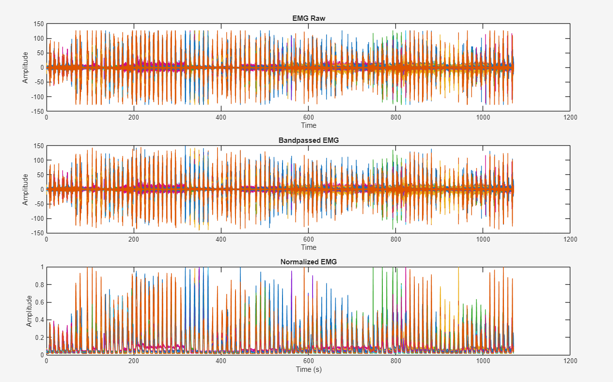

# EMG-Hand-Gesture-Recognition
Implemented using EMG data from the Ninapro DB5 database

##Description
This project uses signal preprocessing techniques and machine learning to classify 17 different hand gestures from 10 subjects from the Ninapro DB5 database. Signal preprocessing was conducted in MATLAB, while the machine learning was conducted in Python using scikit-learn for feature extraction and classifcation. The MATLAB code performs filtering, rectification, RMS enveloping, and normalization to preprocess signals; Python code then segments the signal, windows the data to prepare for time-domain feature extraction, 
and trains an SVM classifier.

##Project Structure
1. processing.py
Loads the sEMG data and conducts signal preprocessing to remove noise and interference to improve data quality for training. Processing methods include:
- Removing DC offset
- Bandpass filter
- Notch filter
- Rectification
- RMS envelope
- Max normalization
Performed in MATLAB

2. feature_extraction.py
Loads preprocessed signal data extracts segments of active movements, applies overlapping windows, and computes mean absolute value (MAV), waveform length (WL), variance (VAR), RMS time-domain features to train an RBF SVM.

##Results

|         | Accuracy | Balanced Accuracy |
|---|---|---|
|Mean| 83.3% | 84.2 % |
|Min| 75.89% | 78.4% |

